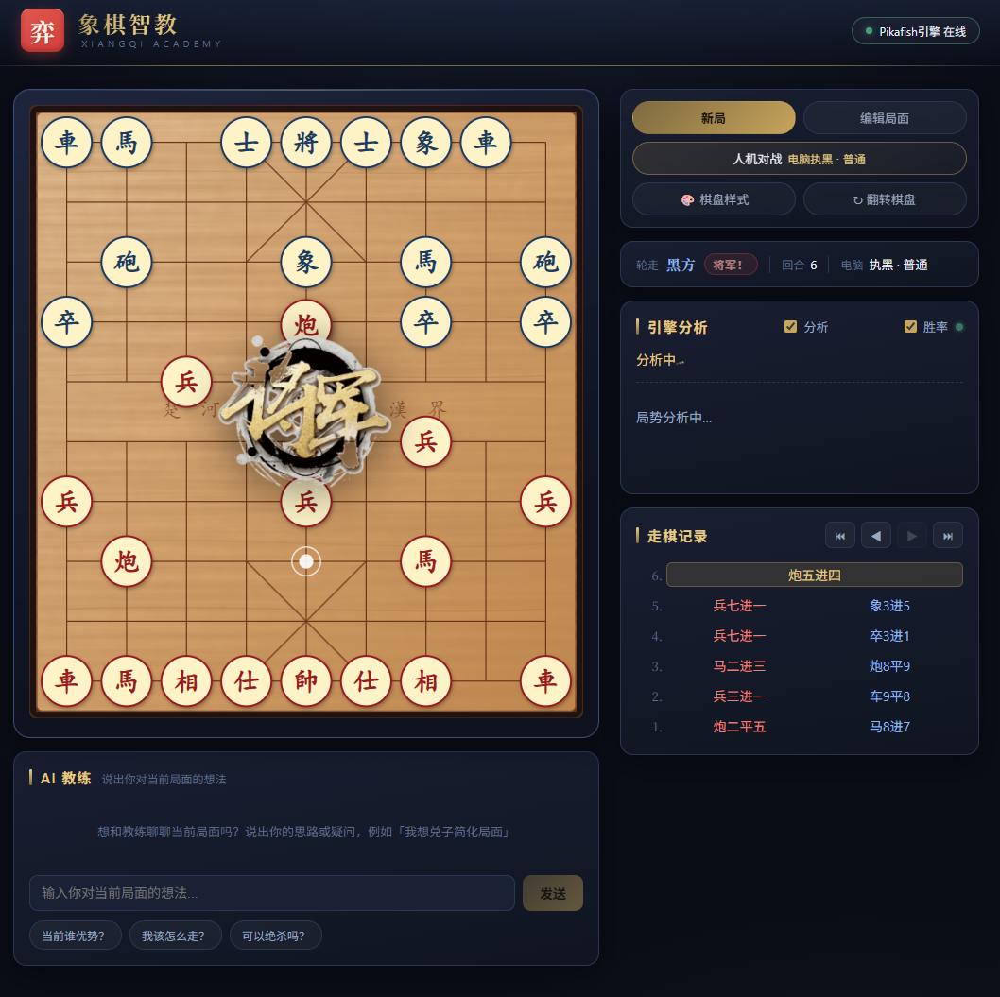

# 象棋智教 (Xiangqi-Claw)

中国象棋智能教学平台 —— 通过 Pikafish 引擎分析和 AI 教练的自然语言解释，帮助你理解每一步棋的好坏，快速提升象棋水平。



## 功能特性

### 交互式棋盘
- **拖拽走棋** — 直接拖动棋子到目标位置，实时显示合法走法提示
- **文字输入** — 支持标准中文记谱法（如"炮二平五"、"马八进七"）和自然语言描述（如"把右边的马跳出来"）
- **语音输入** — 使用浏览器语音识别（Web Speech API，中文），说出走法即可走棋

### 引擎分析
- 基于 **Pikafish** (UCI 协议) 实时评估局面
- 显示评分（分数 / 胜率）、最佳着法和主要变化线
- 引擎分析结果以**中文记谱法**展示（非 UCI 格式），方便阅读

### AI 教练
- 基于大模型（DeepSeek）的自然语言教学解释，对话式交互
- 内置快捷问题：当前谁优势 / 我该怎么走 / 可以绝杀吗（引擎算杀）
- 引擎验证结果（评分、变化线）+ AI 教练通俗解读
- 支持多轮对话，换局面自动切换上下文
- AI 教练始终从棋盘下方玩家的视角进行分析，语气友好，适合初学者

### 编辑棋局
- 从**任意局面**开始分析，无需从头下棋
- 可视化棋子拖放编辑器：选择棋子 → 点击棋盘放置
- 支持**导入/导出 FEN** 字符串
- 一键「清空棋盘」或「恢复初始局面」
- 自由设置走棋方（红方/黑方）

### 其他功能
- **翻转棋盘** — 切换红方/黑方在下方的视角
- **走棋历史** — 完整的走棋记录，可点击回到任意历史局面
- **新局** — 一键重新开始

## 技术栈

| 层 | 技术 |
|---|------|
| 前端 | React 19 + TypeScript + Vite |
| 后端 | Python / FastAPI |
| 引擎 | Pikafish (UCI 协议) |
| AI | 大模型接口（默认 DeepSeek，OpenAI 兼容协议） |
| 实时通信 | WebSocket |

## 本地部署

### 前置要求

- **Python 3.9+**
- **Node.js 18+** 和 npm
- **C++ 编译器**（用于编译 Pikafish，如 g++ 或 clang++）
- **大模型 API Key**（用于 AI 教练功能，如 DeepSeek）

### 第 1 步：克隆项目

```bash
git clone <repo-url>
cd Xiangqi-Claw
```

### 第 2 步：编译 Pikafish 引擎

```bash
cd Pikafish/src
make -j$(nproc) build ARCH=x86-64-modern
cd ../..
```

编译成功后会在 `Pikafish/src/` 目录下生成 `pikafish` 可执行文件。

> **提示**：如果你的 CPU 不支持 `x86-64-modern`，可改用 `x86-64` 或其他架构。运行 `make help` 查看所有可用选项。

### 第 3 步：安装并启动后端

```bash
# 安装 Python 依赖
pip install -r backend/requirements.txt

# 设置大模型 API Key（AI 教练功能必需，以 DeepSeek 为例）
export OPENAI_API_KEY="sk-your-deepseek-key"

# 可选：自定义模型与接口地址（默认即 DeepSeek）
# export LLM_MODEL="deepseek-chat"
# export LLM_BASE_URL="https://api.deepseek.com"

# 从项目根目录启动后端服务
python -m uvicorn backend.main:app --host 127.0.0.1 --port 8000
```

后端默认在 `http://127.0.0.1:8000` 运行。

### 第 4 步：安装并启动前端

打开一个新的终端窗口：

```bash
cd frontend
npm install
npm run dev
```

### 第 5 步：开始使用

打开浏览器访问 **http://localhost:5173**

前端开发服务器已配置自动代理，会将 `/api` 和 `/ws` 请求转发到后端，无需额外配置。

## 项目结构

```
Xiangqi-Claw/
├── Pikafish/                  # Pikafish 引擎源码
├── backend/
│   ├── main.py                # FastAPI 入口
│   ├── engine/                # 引擎通信
│   │   ├── manager.py         # Pikafish 异步进程管理
│   │   ├── uci.py             # UCI 协议命令
│   │   └── analysis.py        # 分析结果解析
│   ├── services/              # 业务逻辑
│   │   ├── openai_client.py   # 大模型客户端配置（DeepSeek，OpenAI 兼容）
│   │   ├── llm.py             # AI 教学解释生成
│   │   ├── move_parser.py     # 中文记谱法/自然语言解析
│   │   └── puzzle.py          # 练习题管理
│   ├── models/schemas.py      # 数据模型
│   └── routers/               # API 路由
│       ├── game.py            # 游戏状态与走法解析
│       ├── analysis.py        # 引擎分析（REST + WebSocket）
│       ├── review.py          # 复盘分析
│       └── puzzle.py          # 练习题
├── frontend/
│   ├── src/
│   │   ├── App.tsx            # 主应用组件
│   │   ├── components/        # React 组件
│   │   │   ├── Board/         # SVG 交互式棋盘
│   │   │   ├── BoardEditor/   # 棋局编辑器
│   │   │   ├── AnalysisPanel/ # 引擎分析 + 实时胜率面板
│   │   │   ├── CoachPanel/    # AI 教练对话面板
│   │   │   ├── MoveHistory/   # 走棋记录
│   │   │   ├── VsComputerDialog/ # 人机对战设置
│   │   │   ├── BoardThemeDialog/ # 棋盘样式
│   │   │   └── BoardEffect/   # 吃子/将军/绝杀特效
│   │   ├── hooks/             # React Hooks
│   │   │   ├── useGame.ts     # 游戏状态管理
│   │   │   └── useEngine.ts   # WebSocket 引擎通信
│   │   └── lib/               # 核心库
│   │       ├── xiangqi.ts     # 象棋规则引擎
│   │       ├── fen.ts         # FEN 解析/生成
│   │       ├── boardThemes.ts # 棋盘主题
│   │       └── notation.ts    # 中文记谱法转换
│   └── package.json
└── README.md
```

## API 接口

| 方法 | 路径 | 说明 |
|------|------|------|
| GET | `/api/health` | 健康检查 |
| GET | `/api/game/starting-fen` | 获取初始 FEN |
| POST | `/api/game/parse-move` | 解析中文走法为 UCI |
| POST | `/api/analysis` | 引擎分析（同步） |
| POST | `/api/explain` | AI 教学解释 |
| WS | `/ws/analysis` | 实时引擎分析流 |

## 配置

| 环境变量 | 说明 | 默认值 |
|---------|------|--------|
| `OPENAI_API_KEY` | 大模型 API Key（DeepSeek 等，OpenAI 兼容） | 无（AI 教练功能必需） |
| `LLM_MODEL` | 大模型名称 | `deepseek-chat` |
| `LLM_BASE_URL` | 大模型接口地址 | `https://api.deepseek.com` |
| `PIKAFISH_PATH` | Pikafish 二进制路径 | `Pikafish/src/pikafish` |

## 许可证

本项目仅供学习和个人使用。Pikafish 引擎遵循其原始许可证。
